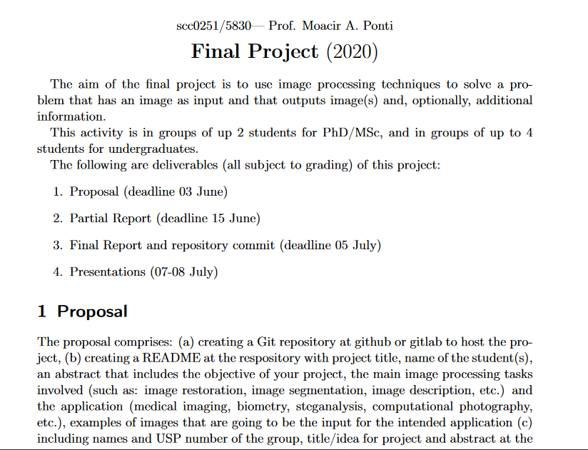

# Image Search

Digital Image Processing Final Project

# Authors

Matheus Branco Borella  - 11218897
Natan Bernardi Cerdeira - 11218984

# Goal

The aim of this project is to index images in a folder and add options for searching
those images by text or other factors in them, or searching for similar images given
a sample (think google but images instead of text). The tasks involved are image
segmentation and image description, but might also use fourier transforms to look
for similar images.

### Usage

1. Install [java 14](https://jdk.java.net/14)
2. Download the [executable jar](https://github.com/natanbc/image-search/releases) (or build it yourself with `./gradlew shadowJar`, the jar will be in `build/libs`)
3. Run it: `java -jar <your_jar.jar>`

You must either be in the same directory as the `.traineddata` files or
set the `TESSDATA_PREFIX` environment variable to that directory.

### Input

- where the images are stored
- filters used for searching

### Output

- list of images matching the provided filters, possibly with a score for the match.


# Example

Using the following image, we have:



```
$ java -jar image-search.jar add images/final_project.png
Adding images/final_project.png
Warning: Invalid resolution 0 dpi. Using 70 instead.
Added images/final_project.png (hash: 490f3fb90e205be5a3b17c224cf75e810a9d4fc9) to index
$ java -jar image-search.jar search "%partial report%"
Searching for %partial report%
Name: final_project.png
Hash: 490f3fb90e205be5a3b17c224cf75e810a9d4fc9
Text: scc0251/5830? Prof. Moacir A. Ponti
Final Project (2020)

The aim of the final project is to use image processing techniques to solve a pro-
blem that has an image as input and that outputs image(s) and, optionally, additional
information.

This activity is in groups of up 2 students for PhD/MSc, and in groups of up to 4
students for undergraduates.

The following are deliverables (all subject to grading) of this project:

1. Proposal (deadline 03 June)

2. Partial Report (deadline 15 June)

3. Final Report and repository commit (deadline 05 July)

4. Presentations (07-08 July)

1 Proposal

?The proposal comprises: (a) creating a Git repository at github or gitlab to host the pro-
ject, (b) creating a README at the respository with project title, name of the student(s),
an abstract that includes the objective of your project, the main image processing tasks
involved (such as: image restoration, image segmentation, image description, etc.) and
the application (medical imaging, biometry, steganalysis, computational photography,
etc.), examples of images that are going to be the input for the intended application (c)
including names and USP number of the group, title/idea for project and abstract at the

Path: index\490f3fb90e205be5a3b17c224cf75e810a9d4fc9.png
```
